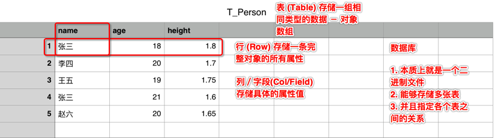
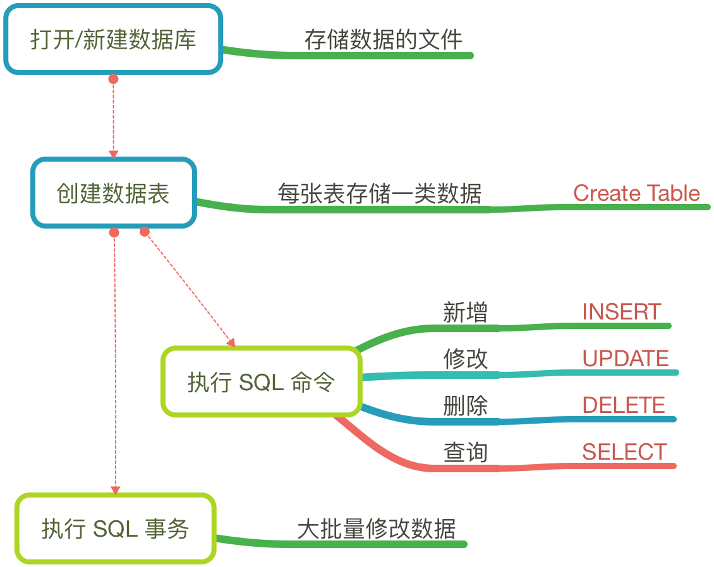

# SQLite

## 简介

* 是一款轻型的数据库
* 设计目标是嵌入式的
* 占用资源少
* 处理速度快
* 当前版本 3.8.10.2，MAC 内置已经安装了 SQLite

官方网站：http://www.sqlite.org/

### 什么是 SQLite

* `SQLite` 是一个 SQL 数据库引擎，具有：
    * 自给自足
        * 不需要任何外部的依赖
    * 无服务器
        * 不需要一个单独的服务器进程或操作的系统
    * 零配置
        * 不需要安装或管理
        * `一个完整的 SQLite 数据库就是一个单一的磁盘文件`
    * 轻量级
        * 完全配置时小于 400K，省略可选功能配置时小于250K
    * 事务性支持
    * 非常适合用于移动端的本地数据存储

* 服务端使用的数据库，如：`Orcal`, `SQL Server`, `MySQL`...则需要独立的服务器，安装，配置，维护……

### 移动应用中使用数据库的优点和难点

#### 优点

1. 将网络数据存储在本地，不用每次都加载，降低用户网络流量开销
2. 不依赖网络，对本地数据进行检索（查询）

#### 难点

* 当本地数据与服务器数据不一致时的数据同步问题

## 关系型数据库的特点

* 一个 `列/字段(COL)` 存储一个值，类似于对象的一个属性
* 一 `行(ROW)` 存储一条记录，类似于一个对象
* 一个 `表(TABLE)` 存储一系列数据，类似于对象数组
* 多个 `表` 之间存在一定 `关系`，类似于对象之间的关系，例如：一条微博数据中包含用户记录

### 术语

* 字段(`Col / Field`)：一个字段存储一个值，可以存储 `INTEGER`, `REAL`, `TEXT`, `BLOB`, `NULL` 五种类型的数据
    * SQLite 在存储时，本质上并不区分准确的数据类型
* 主键：`Primary Key`，`唯一`标示一条记录的字段，具有以下特点：
    * 名字：xxx_id
    * 类型：Integer
    * 自动增长
    * 准确数值由数据库决定，程序员不用关心
* 外键：`Foreign Key`，对应其他关系表的标示，利用`外键` 可以和另外一个`表`建立起"关系"
    * 方便数据维护
    * 节约存储空间

## 开发数据库的步骤

### SQLite 命令

#### DDL - 数据定义语言

| 命令 | 描述 |
| -- | -- |
| CREATE | 创建一个新的表，一个表的视图，或者数据库中的其他对象 |
| ALTER | 修改数据库中的某个已有的数据库对象，比如一个表 |
| DROP | 删除整个表，或者表的视图，或者数据库中的其他对象 |

* 不需要记忆，可以直接从客户端软件复制/粘贴

#### DML - 数据操作语言

| 命令 | 描述 |
| -- | -- |
| INSERT | 新增 |
| UPDATE | 修改 |
| DELETE | 删除 |

* 需要掌握，语法固定，简单

#### DQL - 数据查询语言

| 命令 | 描述 |
| -- | -- |
| SELECT | 查询 |

* 需要掌握一些简单的查询指令

