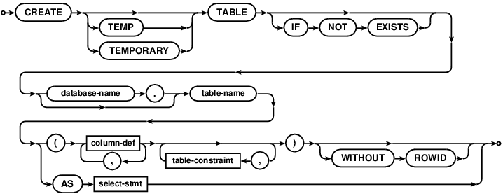

# 常用 SQL

## 创建表

```sql
/*
	创建数据表

	CREATE TABLE '表名' (
		'字段名' 类型(INTEGER, REAL, TEXT, BLOB)
				NOT NULL	不允许为空
				PRIMARY KEY	主键
				AUTOINCREMENT 自增长,
		'字段名2' 类型,
		...
	)

	注意：在开发中，如果是从 Navicat 粘贴的 SQL，需要自己添加一个指令
	IF NOT EXISTS 加在表名前，如果数据表已经存在，就什么也不做
*/

CREATE TABLE IF NOT EXISTS "T_Person" (
	 "id" INTEGER NOT NULL PRIMARY KEY AUTOINCREMENT,
	 "name" TEXT,
	 "age" INTEGER,
	 "heigth" REAL
)

/* 简单约束 */
CREATE TABLE IF NOT EXISTS t_student
(
    id INTEGER PRIMARY KEY AUTOINCREMENT,
    name TEXT,
    age INTEGER
);

CREATE TABLE IF NOT EXISTS t_student
(
    id INTEGER PRIMARY KEY AUTOINCREMENT,
    name TEXT UNIQUE,
    age INTEGER
);

/* 添加主键 */
CREATE TABLE IF NOT EXISTS t_student
(
    id INTEGER PRIMARY KEY AUTOINCREMENT,
    name TEXT,
    age INTEGER,
    score REAL
);

/* 添加主键 */
CREATE TABLE IF NOT EXISTS t_student
(
    id INTEGER,
    name TEXT,
    age INTEGER,
    score REAL,
    PRIMARY KEY(id)
);
```



## 插入

```sql
 INSERT INTO t_student
    (age, score, name)
    VALUES
    ('28', 100, 'zhangsan');

 INSERT INTO t_student
    (name, age)
    VALUES
    ('lisi', '28');

INSERT INTO t_student
    (score)
    VALUES
    (100);

```


## 修改

```sql
UPDATE t_student
    SET name = 'MM'
    WHERE age = 10;

UPDATE t_student
    SET name = 'WW'
    WHERE age is 7;

UPDATE t_student
    SET name = 'XXOO'
    WHERE age < 20;

UPDATE t_student
    SET name = 'NNMM'
    WHERE age < 50 and score > 10;

/*更新记录的name*/
UPDATE t_student SET name = 'zhangsan';
```


## 删除

```sql
DELETE FROM t_student;

DELETE FROM t_student WHERE age < 50;
```


## 查询

```sql
/* 分页 */
SELECT * FROM t_student
ORDER BY id ASC LIMIT 30, 10;

/* 排序 */
SELECT * FROM t_student
WHERE score > 50
ORDER BY age DESC;

SELECT * FROM t_student
WHERE score < 50
ORDER BY age ASC , score DESC;

/* 计量 */
SELECT COUNT(*)
FROM t_student
WHERE age > 50;

/* 别名 */
SELECT name as myName, age as myAge, score as myScore
FROM t_student;

SELECT name myName, age myAge, score myScore
FROM t_student;

SELECT s.name myName, s.age myAge, s.score myScore
FROM t_student s
WHERE s.age > 50;

/* 查询 */
SELECT name, age, score FROM t_student;
SELECT * FROM t_student;
```


## 删除表

```sql
/*删除表*/
DROP TABLE IF EXISTS t_student;
```


