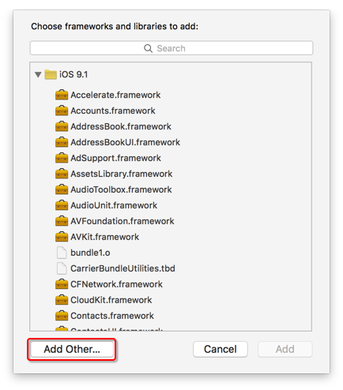
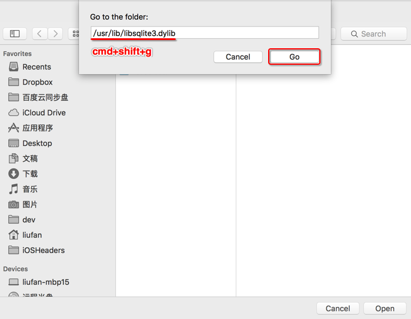
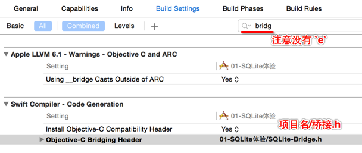

# 准备工作

## 目标

* 导入框架
* 建立数据库管理工具单例

## 导入框架

* 添加 `libsqlite3.tbd`(iOS 9兼容)
* 如果要向下兼容可以如下图所示：




* 创建 `SQLite-Bridge.h`
    * `SQLite3` 框架是一套 `C` 语言的框架，因此需要添加桥接文件
    * 输入以下代码，引入在 Swift 中需要使用的`头文件`

```objc
#import <sqlite3.h>
```

* 选择 `项目`-`TARGETS`-`Build Settings`，搜索 `Bridg`
* 在 `Objective-C Bridging Header` 中输入 `项目名/SQLite-Bridge.h`
    * 如果之前设置过桥接文件，可以直接使用



## 数据库管理工具单例

* 新建 `SQLiteManager.swift`，并且实现以下代码：

```swift
/// 数据库管理工具
class SQLiteManager {
    
    /// 单例
    static let sharedManager = SQLiteManager()
}
```
