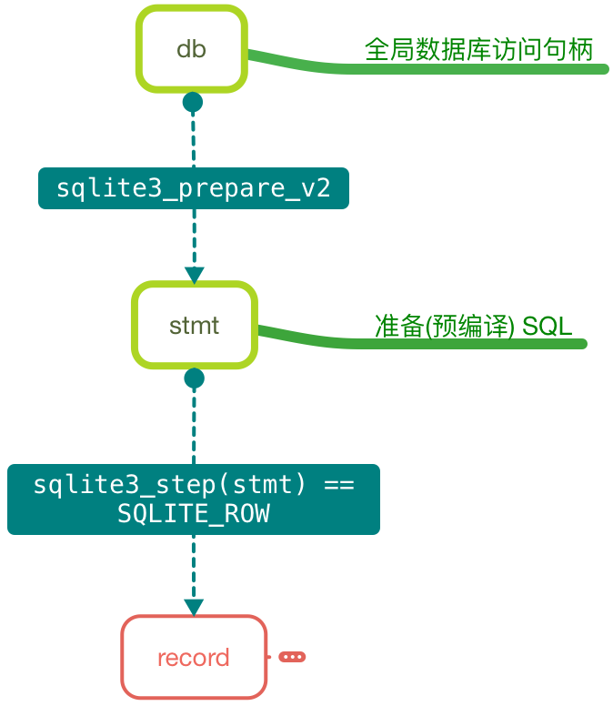
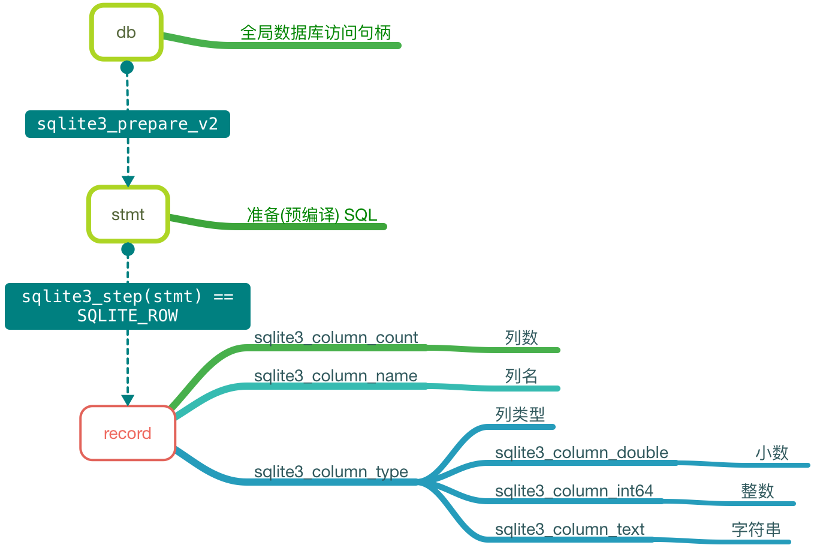

# 查询数据

## 目标

* 掌握查询 SQLite 结果集的方法
* 封装 SQLite 操作方法

## 查询数据示意图




## 代码实现

* 准备伪代码

```swift
/// 从数据库中加载 person 数组
class func persons() -> [Person]? {
    
    // 1. 准备 SQL
    let sql = "SELECT id, name, age, height FROM T_Person;"
    
    // 2. 访问数据库
    
    // 3. 返回结果
    return nil
}
```

* 在 `SQLiteManager` 中添加查询语句，准备结果集

```swift
/// 执行 SQL 返回结果集合
///
/// - parameter sql: sql
func execRecord(sql: String) {
    
    // 1. 预编译 SQL
    /**
        参数 
    
        1. 已经打开的数据库句柄
        2. 要执行的 SQL
        3. 以字节为单位的 SQL 最大长度，传入 -1 会自动计算
        4. SQL 语句地址
            - 后续操作当前查询结果的操作全部基于此地址
            - 需要释放
        5. 未使用的指针地址，通常传入 nil
    */
    var stmt: COpaquePointer = nil
    if sqlite3_prepare_v2(db, sql, -1, &stmt, nil) != SQLITE_OK {
        print("SQL 错误")
        return
    }
    print("SQL 正确")
    
    // 2. 遍历集合
    
    // 3. 释放语句句柄
    sqlite3_finalize(stmt)
    
}
```

* 代码小结

    * 这一部分的工作可以看作是对字符串的 SQL 语句进行编译，并且检查是否存在语法问题
    * 编译成功后通过 `sqlite3_step` 执行 SQL，每执行一次，获取一条记录
    * 通过 `while` 循环直至执行完毕
    * 注意，指令执行完毕后需要释放

* 单步执行

```swift
// 2. 单步执行获取结果集内容
var row = 0
while sqlite3_step(stmt) == SQLITE_ROW {
    print("记录 \(row++)")
}
```

* 新建函数负责从 `stmt` 中获取一条完整的记录

```swift
/// 从 stmt 中获取一条完整的记录
///
/// - parameter stmt: stmt
private func record(stmt: COpaquePointer) {
    print("记录")
}
```

### 获取单条记录

> 所有函数都是以 `sqlite3_column_` 开始

* 获取`列数`

```swift
// 查询结果列数
let colCount = sqlite3_column_count(stmt)
print("列数 \(colCount)")
```

* 遍历每一列获取对应的`列名`和`数据类型`

```swift
// 遍历每一列
for col in 0..<colCount {
    // 列名
    let cName = sqlite3_column_name(stmt, col)
    let name = String(CString: cName, encoding: NSUTF8StringEncoding)
    // 数据类型
    let type = sqlite3_column_type(stmt, col)

    print("\(name) --- \(type)")
}
```

#### 根据不同的数据类型转换对应的数值

* 小数

```swift
var value: AnyObject?
switch type {
case SQLITE_FLOAT:
    value = sqlite3_column_double(stmt, col)
default:
    print("不支持的数据类型")
}

print("\(name) --- \(type) -- \(value)")
```

* 整数

```swift
case SQLITE_INTEGER:
    value = Int(sqlite3_column_int64(stmt, col))
```

* 字符串

```swift
case SQLITE3_TEXT:
    let cText = UnsafePointer<Int8>(sqlite3_column_text(stmt, col))
    value = String(CString: cText, encoding: NSUTF8StringEncoding)
```

* 空值

```swift
case SQLITE_NULL:
    value = NSNull()
```

* 增加返回值和字典，调整后的代码如下：

```swift
/// 从 stmt 中获取一条完整的记录
///
/// - parameter stmt: stmt
private func record(stmt: COpaquePointer) -> [String: AnyObject] {
    // 查询结果列数
    let colCount = sqlite3_column_count(stmt)
    
    // 单行记录字典
    var rowDict = [String: AnyObject]()
    // 遍历每一列
    for col in 0..<colCount {
        // 列名
        let cName = sqlite3_column_name(stmt, col)
        let name = String(CString: cName, encoding: NSUTF8StringEncoding)
        // 数据类型
        let type = sqlite3_column_type(stmt, col)

        var value: AnyObject?
        switch type {
        case SQLITE_FLOAT:
            value = sqlite3_column_double(stmt, col)
        case SQLITE_INTEGER:
            value = Int(sqlite3_column_int64(stmt, col))
        case SQLITE3_TEXT:
            let cText = UnsafePointer<Int8>(sqlite3_column_text(stmt, col))
            value = String(CString: cText, encoding: NSUTF8StringEncoding)
        case SQLITE_NULL:
            value = NSNull()
        default:
            print("不支持的数据类型")
        }
        
        rowDict[name!] = value ?? NSNull()
    }
    
    return rowDict
}
```

#### 完善 `execRecordSet` 函数

* 完善 `execRecordSet` 函数

```swift
/// 执行 SQL 返回结果集合
///
/// - parameter sql: sql
func execRecord(sql: String) -> [[String: AnyObject]]? {
    
    // 1. 预编译 SQL
    /**
        参数 
    
        1. 已经打开的数据库句柄
        2. 要执行的 SQL
        3. 以字节为单位的 SQL 最大长度，传入 -1 会自动计算
        4. SQL 语句地址
            - 后续操作当前查询结果的操作全部基于此地址
            - 需要释放
        5. 未使用的指针地址，通常传入 nil
    */
    var stmt: COpaquePointer = nil
    if sqlite3_prepare_v2(db, sql, -1, &stmt, nil) != SQLITE_OK {
        print("SQL 错误")
        return nil
    }
    
    // 2. 单步执行获取结果集内容
    var result = [[String: AnyObject]]()
    while sqlite3_step(stmt) == SQLITE_ROW {
        result.append(record(stmt))
    }
    
    // 3. 释放语句句柄
    sqlite3_finalize(stmt)
    
    // 4. 返回结果
    return result
}
```

* 在 `Person` 模型中加载 `Person` 列表

```swift
/// 从数据库中加载 person 数组
class func persons() -> [Person]? {
    
    // 1. 准备 SQL
    let sql = "SELECT id, name, age, height FROM T_Person;"
    
    // 2. 访问数据库
    guard let array = SQLiteManager.sharedManager.execRecord(sql) else {
        return nil
    }
    
    // 3. 遍历数组字典转模型
    var arrayM = [Person]()
    
    for dict in array {
        arrayM.append(Person(dict: dict))
    }
    
    // 4. 返回结果
    return arrayM
}
```


* 测试代码

```swift
print((Person.persons() ?? []) as NSArray)
```

### 小结

