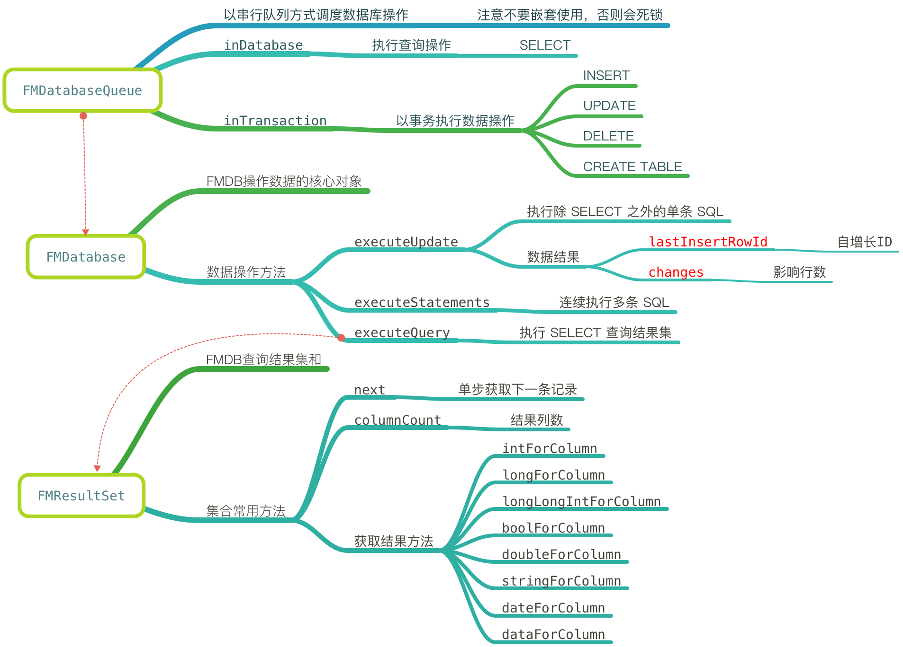

# FMDB

## 使用框架

### 官网地址

https://github.com/ccgus/fmdb

### 直接拖拽

* 将 fmdb 文件夹拖入项目
* 建立桥接文件
* 将 `Swift extensions` 拖入项目
* 添加 `libsqlite3.tdb`

### Podfile

* 不推荐

```bash
use_frameworks!
pod 'FMDB', :git => 'https://github.com/robertmryan/fmdb.git'
```

## FMDB 架构图



## 代码演练

### 单例

* 单例代码

```swift
/// 数据库名称
private let dbName = "readme.db"

/// 数据库管理工具
class SQLiteManager {

    static let sharedManager = SQLiteManager()
    
    // 全局数据库队列 - 支持线程操作
    var queue: FMDatabaseQueue
    
    private init() {
        var path = NSSearchPathForDirectoriesInDomains(.DocumentDirectory, .UserDomainMask, true).last!
        path = (path as NSString).stringByAppendingPathComponent(dbName)
        print(path)
        
        queue = FMDatabaseQueue(path: path)
        createTable()
    }
    
    /// 创建数据表
    private func createTable() {
        let path = NSBundle.mainBundle().pathForResource("db.sql", ofType: nil)!
        let sql = try! String(contentsOfFile: path)
        
        queue.inTransaction { (db, _) in
            if db.executeStatements(sql) {
                print("创表成功")
            } else {
                print("创表失败")
            }
        }
    }
}
```

#### 代码小结

* 将数据库名称定义成常量，可以避免在 `AppDelegate` 中打开数据库
* `init` 创建队列并指定路径
    * 如果数据库不存在，会建立数据库，然后打开
    * 如果数据库已经存在，会直接打开
* 创表函数，可以把所有数据表的 SQL 保存在 `db.sql` 中，直接通过 `executeStatements` 一次性将所有数据表建立
* `queue` 是 FMDB 提供的一个核心类，封装了一个串行队列，能够实现多线程数据操作，而且是线程安全的

### 插入数据

* 传统方法

```swift
func demoInsert1() {
    // 模拟 SQL 注入
    let name = "王五"
    let sql = "INSERT INTO T_Person (name, age, height) VALUES ('\(name)', 18, 1.8);"
    print(sql)
    
    SQLiteManager.sharedManager.queue.inDatabase { (db) -> Void in
        if db.executeStatements(sql) {
            print("插入成功")
        }
    }
}
```

> 存在的问题：SQL 注入

* 修改 name 数值，演示 SQL 注入

```swift
let name = "王五', 18, 1.8); DELETE FROM T_Person; --"
```

* 使用预编译指令插入数据 - 绑定参数

```swift
func demoInsert2() {
    let sql = "INSERT INTO T_Person (name, age, height) VALUES (?, ?, ?);"
    
    SQLiteManager.sharedManager.queue.inDatabase { (db) -> Void in
        if db.executeUpdate(sql, "张三1", 18, 1.7) {
            print("插入成功 \(db.lastInsertRowId())")
        } else {
            print("插入失败")
        }
    }
}
```

* 使用字典更新 SQL － FMDB 特有语法

```swift
func demoInsert3(dict: [String: AnyObject]) {
        let sql = "INSERT INTO T_Person (name, age, height) VALUES (:name, :age, :height);"
        
        SQLiteManager.sharedManager.queue.inDatabase { (db) -> Void in
            if db.executeUpdate(sql, withParameterDictionary: dict) {
                print("插入成功 \(db.lastInsertRowId())")
            } else {
                print("插入失败")
            }
        }
    }
```

### 删除数据

```swift
func demoDelete(id: Int) {
    let sql = "DELETE FROM T_Person WHERE id = ?;"
    
    SQLiteManager.sharedManager.queue.inDatabase { (db) -> Void in
        if db.executeUpdate(sql, id) {
            print("删除成功 \(db.changes())")
        } else {
            print("删除失败")
        }
    }
}
```

### 更新数据

```swift
func demoUpdate(dict: [String: AnyObject]) {
    let sql = "UPDATE T_Person set name = :name, age = :age, height = :height WHERE id = :id;"
    
    SQLiteManager.sharedManager.queue.inDatabase { (db) -> Void in
        if db.executeUpdate(sql, withParameterDictionary: dict) {
            print("更新成功 \(db.changes())")
        } else {
            print("更新失败")
        }
    }
}
```

### 查询数据

* 固定 SQL 的查询方式

```swift
func persons1() {
    let sql = "SELECT id, name, age, height FROM T_Person;"
    
    SQLiteManager.sharedManager.queue.inDatabase { (db) -> Void in
        
        guard let rs = db.executeQuery(sql) else {
            return
        }
        
        while rs.next() {
            let id = rs.intForColumn("id")
            let name = rs.stringForColumn("name")
            let age = rs.stringForColumn("age")
            let height = rs.doubleForColumn("height")
            
            print("\(id) \(name) \(age) \(height)")
        }
    }
}
```

* 动态 SQL 的查询方式

```swift
func persons2() {
    let sql = "SELECT id, name, age, height FROM T_Person;"
    
    var result = [[String: AnyObject]]()
    
    SQLiteManager.sharedManager.queue.inDatabase { (db) -> Void in
        
        print(NSThread.currentThread())
        
        guard let rs = db.executeQuery(sql) else {
            return
        }
        
        while rs.next() {
            // 0. 字典
            var dict = [String: AnyObject]()
            
            // 1. 列数
            let colCount = rs.columnCount()
            
            for col in 0..<colCount {
                // 2. 列名
                let colName = rs.columnNameForIndex(col)
                // 3. 值
                dict[colName] = rs.objectForColumnIndex(col)
            }
            result.append(dict)
        }
    }
    
    print(result)
}
```

* 在 `SQLiteManager` 中封装查询方法

```swift
/// 执行 SQL 返回结果集合
///
/// - parameter sql: sql
func execRecordset(sql: String, finished: ([[String: AnyObject]]) -> ()) {
    
    dispatch_async(dispatch_get_global_queue(0, 0)) { () -> Void in
        var result = [[String: AnyObject]]()
        
        self.queue.inDatabase { (db) -> Void in
            
            guard let rs = db.executeQuery(sql) else {
                dispatch_async(dispatch_get_main_queue()) { finished(result) }
                return
            }
            
            while rs.next() {
                // 0. 字典
                var dict = [String: AnyObject]()
                // 1. 列数
                let colCount = rs.columnCount()
                
                for col in 0..<colCount {
                    // 2. 列名
                    let colName = rs.columnNameForIndex(col)
                    // 3. 值
                    dict[colName] = rs.objectForColumnIndex(col)
                }
                result.append(dict)
            }
        }
        
        dispatch_async(dispatch_get_main_queue()) { finished(result) }
    }
}
```

### 批量插入数据

```swift
func manyPersons() {
    let sql = "INSERT INTO T_Person (name, age, height) VALUES (:name, :age, :height);"
    
    let start = CACurrentMediaTime()
    print("开始")
    
    SQLiteManager.sharedManager.queue.inTransaction { (db, rollback) -> Void in
        
        for i in 0..<10000 {
            let age = 10 + random() % 10
            let height = 1.5 + Double(random() % 5) / 10
            
            let dict = ["name": "zhangsan - \(i)", "age": age, "height": height]
            
            if !db.executeUpdate(sql, withParameterDictionary: dict as [NSObject : AnyObject]) {
                rollback.memory = true
                break
            }
            
            // 模拟失败
            if i == 1000 {
                rollback.memory = true
                break
            }
        }
    }
    print("完成 \(CACurrentMediaTime() - start)")
}
```

## FMDB 主要函数

* 执行单条语句 `executeUpdate`
* 查询 `executeQuery`
* 执行多条语句 `executeStatements`，创表时使用

> 要设置 rollBack 可以使用 `rollBack.memory = true`
